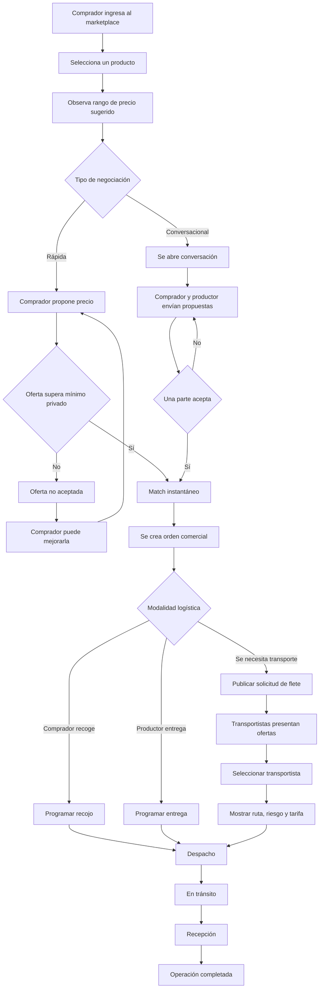
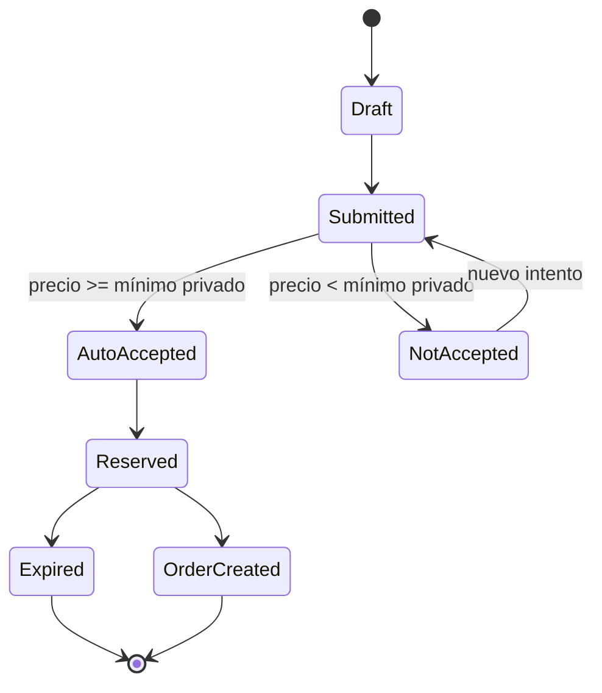
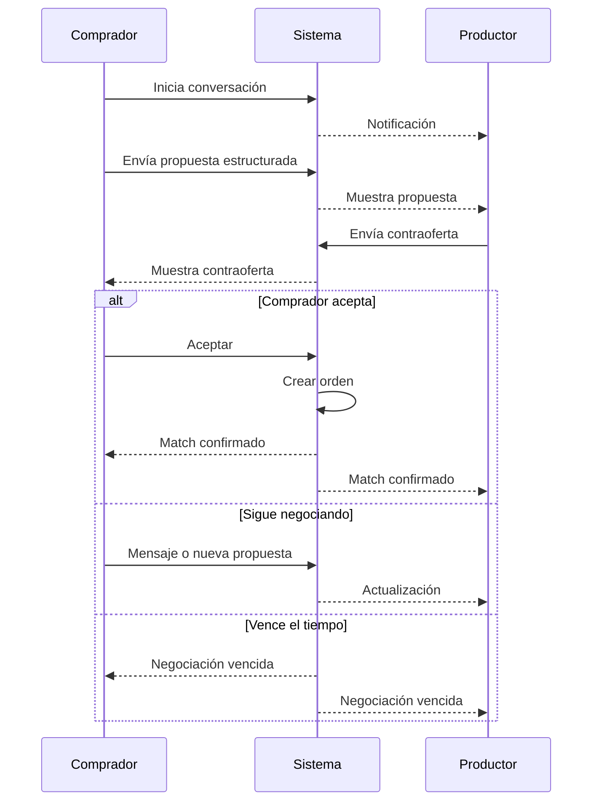
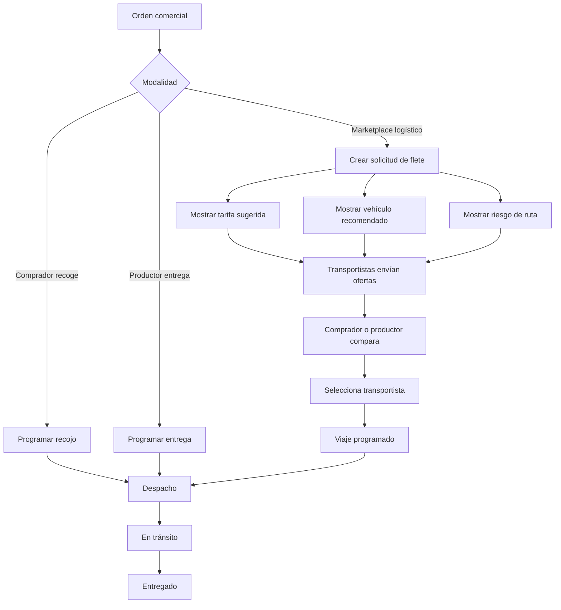
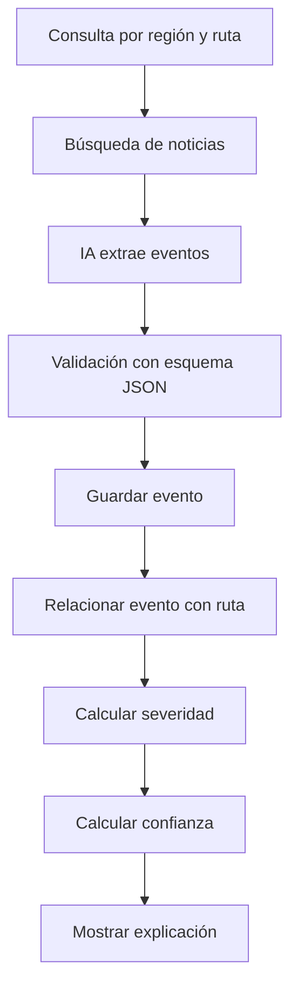
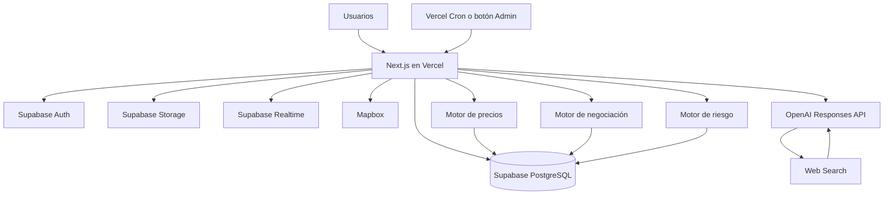
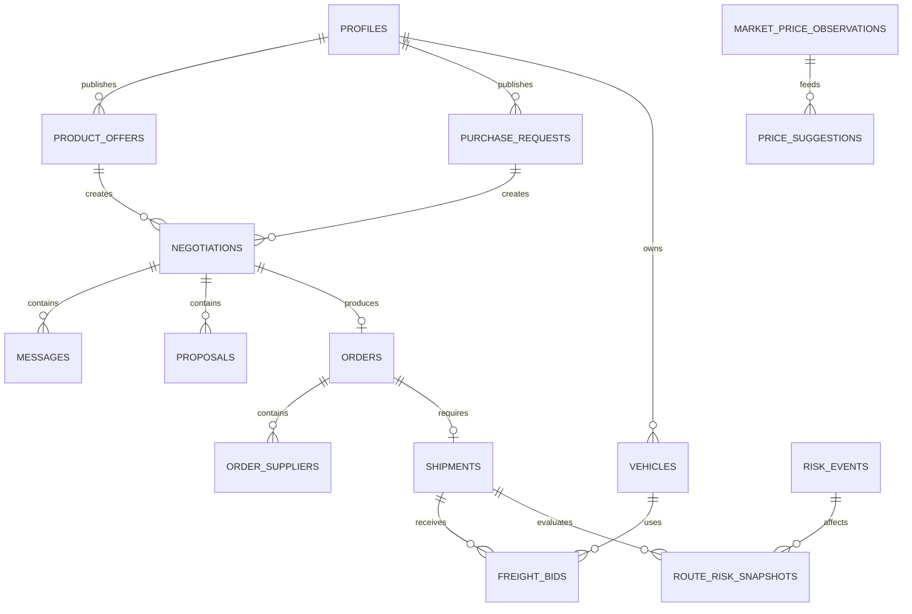

# MVP de Hackathon — Marketplace rural con negociación y logística inteligente

> **Documento de ejecución para comenzar el desarrollo inmediatamente**  
> **Objetivo:** entregar un prototipo funcional, demostrable y coherente; no una plataforma productiva completa.  
> **Producto:** marketplace de productos rurales que conecta compradores, productores y transportistas, con dos modalidades de negociación, sugerencia de precios y riesgo logístico contextual.

---

# 0. Decisión ejecutiva

## Qué vamos a construir

Una aplicación web responsive donde:

1. El comprador explora productos publicados o publica un requerimiento.
2. La plataforma muestra un **precio referencial sugerido**, no un precio obligatorio.
3. El comprador elige entre:
   - **Negociación rápida:** propone un precio y el sistema puede aceptarlo automáticamente si supera el mínimo privado del productor.
   - **Negociación conversacional:** comprador y productor conversan y envían propuestas estructuradas hasta alcanzar un acuerdo.
4. Cuando existe un acuerdo comercial, se elige una modalidad logística:
   - recoge el comprador;
   - entrega el productor;
   - se solicita transporte dentro de la plataforma.
5. Si se solicita transporte, empresas e independientes presentan ofertas de flete.
6. La plataforma muestra:
   - tarifa logística sugerida;
   - vehículo recomendado;
   - riesgo operativo estimado;
   - confianza y vigencia de la información.
7. La operación concluye con un registro de despacho y entrega.

## Qué NO vamos a construir durante la hackathon

- pagos reales;
- billetera o escrow;
- facturación;
- verificación legal completa;
- seguimiento GPS real continuo;
- seguros;
- crédito;
- aplicación móvil nativa;
- modelo predictivo entrenado con grandes históricos;
- integración automática con todas las fuentes públicas;
- operación nacional completa;
- algoritmo perfecto de precios;
- contratos jurídicos automatizados.

> Durante la demostración, el pago será **simulado** y el seguimiento utilizará estados de viaje, no GPS de producción.

---

# 1. Propuesta de valor del MVP

> **Encuentra productos rurales, negocia el precio y contrata transporte con información actualizada sobre costos y riesgos.**

## Diferenciadores demostrables

- Marketplace abierto: no restringe las oportunidades a coincidencias perfectas.
- Precio referencial, no impuesto.
- Negociación rápida mediante mínimo privado.
- Negociación conversacional con chat y propuestas estructuradas.
- Transporte propio o contratado dentro de la plataforma.
- Ofertas de transportistas al estilo de una subasta inversa.
- Riesgo contextual de acceso y ruta.
- Confianza y vigencia separadas del riesgo.
- Opción de atender grandes requerimientos con varios productores.
- Explicación de las recomendaciones generadas por IA.

---

# 2. Usuarios del MVP

## 2.1 Productor

Puede:

- crear su perfil;
- fijar una ubicación aproximada;
- publicar un producto;
- definir cantidad y unidad;
- habilitar negociación rápida;
- establecer un mínimo privado;
- recibir ofertas;
- conversar con compradores;
- aceptar propuestas;
- seleccionar modalidad logística;
- registrar despacho.

## 2.2 Comprador

Puede:

- crear su perfil;
- definir ubicación de entrega;
- explorar productos;
- publicar requerimientos;
- observar precio sugerido;
- realizar oferta rápida;
- iniciar negociación conversacional;
- seleccionar uno o varios productores;
- contratar transporte;
- confirmar recepción.

## 2.3 Transportista

Puede:

- registrar perfil;
- registrar vehículo;
- explorar solicitudes de transporte;
- observar tarifa sugerida;
- observar riesgo y ruta;
- enviar oferta de flete;
- actualizar estado del viaje;
- registrar entrega.

## 2.4 Administrador

Puede:

- revisar usuarios;
- revisar publicaciones;
- crear o confirmar eventos de riesgo;
- cargar observaciones de precios;
- revisar operaciones;
- intervenir ante incidencias;
- activar datos de demostración.

---

# 3. Alcance MoSCoW

## MUST — obligatorio para la demostración

- [ ] Registro e inicio de sesión.
- [ ] Selección de rol.
- [ ] Perfil básico.
- [ ] Marketplace de productos.
- [ ] Publicación de producto.
- [ ] Publicación de requerimiento.
- [ ] Precio sugerido visible.
- [ ] Mínimo del productor privado.
- [ ] Negociación rápida.
- [ ] Negociación conversacional.
- [ ] Chat en tiempo real.
- [ ] Propuestas estructuradas.
- [ ] Creación de orden.
- [ ] Selección de logística.
- [ ] Marketplace de transporte.
- [ ] Registro de vehículos.
- [ ] Oferta de flete.
- [ ] Riesgo, confianza y vigencia.
- [ ] Panel de estados de la operación.
- [ ] Datos de prueba.
- [ ] Deploy público.

## SHOULD — realizar si el núcleo ya funciona

- [ ] Requerimientos atendidos por varios productores.
- [ ] Mapa con origen, destino y ruta.
- [ ] Recomendación de vehículo.
- [ ] Carga de retorno.
- [ ] Fotografías de despacho y recepción.
- [ ] Notificaciones dentro de la aplicación.
- [ ] Búsqueda de noticias mediante IA.
- [ ] Panel administrativo de eventos.
- [ ] Responsive para teléfono.

## COULD — solo si sobra tiempo

- [ ] Correos de notificación.
- [ ] Mensajes de voz.
- [ ] Modo PWA.
- [ ] traducción quechua/aimara;
- [ ] historial de reputación;
- [ ] comparación de escenarios logísticos;
- [ ] gráfico de evolución de precios;
- [ ] recomendaciones automáticas de consolidación.

## WON'T — fuera de la hackathon

- [ ] Pasarela de pago.
- [ ] Custodia de dinero.
- [ ] Facturación SUNAT.
- [ ] Verificación biométrica.
- [ ] Tracking GPS del conductor.
- [ ] Crédito.
- [ ] Seguro real.
- [ ] App Android/iOS nativa.
- [ ] IA autónoma que tome decisiones.
- [ ] predicción estadística certificada de conflictos.

---

# 4. Flujo principal de la demostración



---

# 5. Dos tipos de negociación

# 5.1 Negociación rápida

## Objetivo

Reducir el tiempo de negociación cuando el productor está dispuesto a aceptar automáticamente cualquier propuesta igual o superior a un mínimo privado.

## Datos configurados por el productor

- cantidad disponible;
- pedido mínimo;
- mínimo privado por unidad;
- negociación rápida activa/inactiva;
- tiempo de reserva;
- cantidad máxima por operación.

## Datos visibles para el comprador

- rango sugerido;
- precio referencial central;
- cantidad disponible;
- botones para modificar propuesta;
- estado del riesgo;
- logística estimada.

## Datos que NO se muestran

- mínimo privado del productor;
- fórmula interna;
- cuánto faltó para alcanzar el mínimo;
- margen del productor;
- ofertas privadas de otros compradores.

## Ejemplo

- Precio referencial mostrado: **S/ 40**
- Mínimo privado del productor: **S/ 35**
- Oferta del comprador: **S/ 37**
- Resultado: **match automático**

Segundo caso:

- Oferta del comprador: **S/ 34**
- Resultado: **oferta no aceptada**
- El sistema no indica que faltó S/ 1.

## Interfaz sugerida

```text
Precio orientativo: S/ 38 – S/ 43
Referencia: S/ 40

[-5 %] [Usar S/ 40] [+5 %] [Ingresar otro monto]

Cantidad: [ 10 unidades ]

[Enviar oferta rápida]
```

## Estados



## Regla exacta

```ts
type QuickOfferResult =
  | { status: "AUTO_ACCEPTED"; orderId: string; expiresAt: string }
  | { status: "NOT_ACCEPTED"; attemptsRemaining: number }
  | { status: "PENDING"; negotiationId: string }
  | { status: "UNAVAILABLE" };

function evaluateQuickOffer(input: {
  offeredUnitPrice: number;
  hiddenFloorPrice: number;
  requestedQuantity: number;
  availableQuantity: number;
  quickModeEnabled: boolean;
  autoAcceptEnabled: boolean;
}): QuickOfferResult {
  if (input.requestedQuantity > input.availableQuantity) {
    return { status: "UNAVAILABLE" };
  }

  if (!input.quickModeEnabled) {
    return { status: "PENDING", negotiationId: "generated-id" };
  }

  if (
    input.autoAcceptEnabled &&
    input.offeredUnitPrice >= input.hiddenFloorPrice
  ) {
    return {
      status: "AUTO_ACCEPTED",
      orderId: "generated-id",
      expiresAt: "15-minutes-from-now",
    };
  }

  return {
    status: "NOT_ACCEPTED",
    attemptsRemaining: 2,
  };
}
```

## Seguridad del mínimo privado

- El mínimo se almacena en una tabla/columna sin permiso de lectura desde cliente.
- La evaluación se realiza en servidor o función SQL.
- Nunca se envía el mínimo en la respuesta.
- No se devuelve el porcentaje faltante.
- Máximo sugerido: **3 intentos por comprador y publicación cada 60 minutos**.
- Las ofertas deben cambiar por un incremento mínimo.
- El mínimo no aparece en logs del navegador.
- El productor puede modificarlo, pero no mientras exista una reserva activa.

## Reserva de inventario

Cuando una oferta es aceptada:

- se reserva la cantidad durante 15 minutos;
- se crea una orden en estado `PENDING_LOGISTICS`;
- si el comprador abandona el proceso, la reserva vence;
- el stock vuelve a estar disponible.

> La reserva debe ejecutarse dentro de una transacción para evitar vender dos veces la misma cantidad.

---

# 5.2 Negociación conversacional

## Objetivo

Permitir una negociación más detallada cuando importan:

- calidad;
- variedad;
- fecha;
- volumen;
- entrega parcial;
- transporte;
- certificación;
- forma de presentación;
- condiciones especiales.

## Experiencia

La conversación se parece a un chat de hospedaje, pero las decisiones comerciales se envían mediante tarjetas estructuradas.

## Tipos de mensaje

- texto;
- imagen;
- pregunta;
- documento;
- propuesta;
- contraoferta;
- aceptación;
- rechazo;
- solicitud de muestra.

## Tarjeta de propuesta

```text
PROPUESTA COMERCIAL

Producto: Papa Canchán
Cantidad: 3 000 kg
Precio: S/ 1.35 por kg
Entrega: 28 de agosto
Logística: requiere transporte
Calidad: calibre comercial
Vigencia: 12 horas

[Aceptar] [Contraofertar] [Rechazar]
```

## Reglas

- El productor define una ventana inicial: 12, 24, 48 o 72 horas.
- Cada contraoferta reinicia la ventana de vigencia (no solo la extensión única).
- Solo una propuesta puede estar activa por parte.
- Solo puede existir una conversación con tarjeta activa por comprador-publicación a la vez.
- Aceptar una propuesta crea la orden y bloquea nuevas tarjetas sobre esa conversación.
- El texto del chat no modifica automáticamente el acuerdo.
- Solo una tarjeta aceptada constituye el acuerdo registrado.
- Al vencer sin respuesta, la conversación queda de solo lectura; para retomar se inicia una nueva.

> Estados formales de la conversación: ver `docs/ARQUITECTURA.md`.

## Flujo



---

# 6. Precio sugerido

## Regla principal

> La plataforma muestra una referencia. El comprador y el productor deciden el precio final.

## Valores mostrados

- rango bajo;
- precio central;
- rango alto;
- confianza de la sugerencia;
- fecha de actualización;
- explicación breve.

## Ejemplo

```text
Rango orientativo: S/ 1.18 – S/ 1.32 por kg
Referencia central: S/ 1.25
Confianza: 76 %
Actualizado: hoy
Base: 22 observaciones comparables
```

## El precio debe separarse en componentes

1. precio del producto en origen;
2. costo de carga;
3. tarifa de transporte;
4. contingencia logística;
5. precio estimado en destino.

```text
Producto en origen: S/ 1.25/kg
Transporte estimado: S/ 0.21/kg
Contingencia actual: S/ 0.03/kg
Estimado en destino: S/ 1.49/kg
```

## Algoritmo MVP

1. Normalizar observaciones a soles por unidad base.
2. Buscar observaciones del mismo:
   - producto;
   - variedad;
   - región;
   - calidad.
3. Usar últimos 30 días.
4. Si hay pocos datos, ampliar a 90 días.
5. Eliminar valores extremos.
6. Calcular mediana ponderada por recencia.
7. Generar rango según dispersión y confianza.
8. Aplicar ajustes conocidos:
   - calidad;
   - volumen;
   - presentación;
   - ubicación.
9. Mantener el riesgo logístico fuera del valor puro del producto.

## Fórmula simplificada

```text
precio_base = mediana_ponderada(observaciones_comparables)

ajuste_calidad = precio_base × factor_calidad
ajuste_volumen = precio_base × factor_volumen

precio_central = precio_base + ajuste_calidad + ajuste_volumen

amplitud = precio_central × porcentaje_incertidumbre

rango_bajo = precio_central - amplitud
rango_alto = precio_central + amplitud
```

## Confianza de precio

| Factor | Puntaje |
|---|---:|
| Cantidad de observaciones | 0–40 |
| Recencia | 0–30 |
| Coincidencia geográfica | 0–20 |
| Calidad de datos | 0–10 |

## Reglas de interfaz

- Confianza menor a 40 %: mostrar **“referencia preliminar”**.
- Confianza 40–69 %: mostrar **“referencia moderada”**.
- Confianza 70–100 %: mostrar **“referencia sólida”**.
- Nunca mostrar “precio correcto”.
- Nunca impedir ofertas fuera del rango.

---

# 7. Requerimientos atendidos por varios productores

## Regla

La opción existe, pero no se impone.

## Configuración del comprador

- `requires_single_supplier`
- `accepts_partial_offers`
- `accepts_multiple_suppliers`

## Ejemplo

Requerimiento: 10 toneladas.

| Productor | Cantidad | Precio |
|---|---:|---:|
| Productor A | 5 t | S/ 1.24/kg |
| Productor B | 3 t | S/ 1.20/kg |
| Productor C | 2 t | S/ 1.27/kg |

El comprador puede:

- elegir un productor;
- aceptar una oferta parcial;
- combinar propuestas;
- esperar nuevas ofertas.

## MVP

Para la primera versión:

- permitir seleccionar varias propuestas;
- sumar cantidades;
- crear una orden principal;
- crear un registro de aporte por productor;
- mostrar una sola necesidad logística o varias.

---

# 8. Flujo logístico

## Modalidades

### A. Recojo del comprador

El comprador proporciona:

- vehículo;
- conductor;
- fecha;
- punto de recojo.

### B. Entrega del productor

El productor indica:

- precio con entrega;
- vehículo;
- fecha estimada.

### C. Transporte dentro de la plataforma

Se publica una solicitud y los transportistas presentan ofertas.

## Flujo de transporte



---

# 9. Negociación del flete

## Datos de solicitud

- origen;
- destino;
- fecha;
- producto;
- peso;
- volumen;
- número de bultos;
- puntos de recojo;
- vehículo sugerido;
- tarifa inicial;
- riesgo;
- tiempo estimado;
- responsable de carga;
- responsable de descarga.

## Oferta del transportista

- tarifa;
- vehículo;
- fecha de salida;
- tiempo estimado;
- condiciones;
- cobertura;
- ayudante incluido;
- disponibilidad de retorno.

## Negociación

Para el MVP, utilizar una sola modalidad:

- solicitante publica tarifa inicial;
- transportista envía tarifa;
- solicitante acepta o rechaza;
- máximo una contraoferta.

## Selección

Mostrar:

- tarifa;
- vehículo;
- capacidad;
- documentos declarados;
- fecha;
- riesgo adaptado;
- experiencia simulada;
- servicios incluidos.

---

# 10. Riesgo operativo

## No se evalúa al productor

La etiqueta aparece en la publicación, pero su nombre debe ser:

> **Riesgo actual de acceso y transporte**

No utilizar:

> Productor riesgoso.

## Tres indicadores visibles

### 1. Riesgo

Puntaje de 0 a 100.

### 2. Confianza

Qué tan confiable es la información.

### 3. Vigencia

Cuándo se actualizó.

## Ejemplo

```text
Riesgo de ruta: 68/100 — Alto
Confianza: 84 %
Actualizado: hace 22 minutos
Motivo: protesta anunciada y tránsito restringido
Retraso estimado: 1 h 20 min
Ruta alternativa: disponible
Impacto estimado: +S/ 120 a +S/ 190
```

## Dos momentos de cálculo

### En el marketplace

Antes de conocer el destino exacto:

- mostrar riesgo de acceso al origen;
- utilizar ubicación aproximada del productor.

### Después de seleccionar destino

- calcular riesgo de toda la ruta;
- mostrar impacto en tiempo;
- mostrar impacto en tarifa;
- sugerir ruta alternativa.

---

# 11. Fuentes de riesgo para el MVP

## Fuente 1 — eventos cargados manualmente

El administrador crea eventos:

- bloqueo;
- protesta;
- lluvia;
- accidente;
- carretera restringida;
- puente dañado.

Esta fuente garantiza que la demostración funcione.

## Fuente 2 — reportes de usuarios

Productores y transportistas pueden reportar:

- vía libre;
- paso restringido;
- ruta bloqueada;
- trocha intransitable;
- demora;
- accidente.

## Fuente 3 — búsqueda web con IA

La aplicación consulta noticias actuales y devuelve eventos estructurados.

## Importante

Para una hackathon:

- ejecutar el análisis bajo demanda;
- permitir un botón de administrador: **“Actualizar riesgos”**;
- mantener eventos precargados;
- no depender totalmente de una consulta externa durante el pitch.

---

# 12. Pipeline de IA para riesgo



## Salida estructurada esperada

```json
{
  "eventType": "ROAD_BLOCK",
  "title": "Bloqueo parcial en vía principal",
  "region": "Puno",
  "province": "El Collao",
  "district": "Ilave",
  "roadName": "PE-3S",
  "latitude": -16.08,
  "longitude": -69.64,
  "severity": 4,
  "sourceConfidence": 0.85,
  "startedAt": "2026-07-18T10:00:00-05:00",
  "expectedEndAt": null,
  "summary": "Tránsito restringido por protesta.",
  "sourceUrls": []
}
```

## Cálculo inicial

```text
riesgo_eventos =
Σ(severidad × proximidad × confianza_fuente × vigencia)

riesgo_total =
riesgo_eventos
+ riesgo_acceso
+ riesgo_climático
+ riesgo_operativo
- disponibilidad_ruta_alternativa
```

## Semáforo

| Puntaje | Nivel |
|---:|---|
| 0–20 | Bajo |
| 21–40 | Moderado |
| 41–60 | Relevante |
| 61–80 | Alto |
| 81–100 | Crítico |

## Confianza

```text
confianza =
autoridad_fuente
+ cantidad_fuentes
+ coincidencia
+ recencia
+ ubicación
```

## Qué NO debemos afirmar

No decir:

> “Existe 73 % de probabilidad de bloqueo”.

Decir:

> “Riesgo operativo estimado: 73/100, con confianza de información de 82 %”.

---

# 13. Stack definitivo

## Frontend y backend web

- **Next.js con App Router**
- **TypeScript**
- **Tailwind CSS**
- **shadcn/ui**
- **React Hook Form**
- **Zod**
- **Lucide Icons**
- **date-fns**
- **Sonner** para notificaciones

## Base de datos y servicios

- **Supabase PostgreSQL**
- **Supabase Auth**
- **Supabase Storage**
- **Supabase Realtime**
- **Row Level Security**

## IA

- **OpenAI Responses API**
- **Web search** para noticias actuales
- **Structured Outputs** para convertir resultados a JSON validable
- Zod para segunda validación

## Mapas

- **Mapbox GL JS**
- **Mapbox Geocoding**
- **Mapbox Directions**
- **Turf.js** para calcular proximidad de eventos a rutas

## Deploy

- **Vercel**
- **Vercel Cron** opcional
- **GitHub**

## Calidad

- ESLint
- Prettier
- Vitest para lógica crítica
- GitHub Issues/Projects para tareas

## Decisiones para ahorrar tiempo

- No usar microservicios.
- No usar NestJS.
- No usar Prisma.
- No usar Redux.
- No usar Docker para el deploy del MVP.
- No construir app móvil nativa.
- No crear un backend separado.
- Usar Route Handlers y Server Actions.
- Generar tipos de Supabase.

---

# 14. Arquitectura



---

# 15. Dependencias

```bash
pnpm add \
  @supabase/supabase-js \
  @supabase/ssr \
  openai \
  zod \
  react-hook-form \
  @hookform/resolvers \
  mapbox-gl \
  @turf/turf \
  date-fns \
  lucide-react \
  sonner \
  clsx \
  tailwind-merge

pnpm add -D \
  vitest \
  prettier \
  prettier-plugin-tailwindcss
```

## Inicialización

```bash
pnpm create next-app@latest rural-marketplace \
  --ts \
  --tailwind \
  --eslint \
  --app \
  --src-dir \
  --import-alias "@/*"

cd rural-marketplace

pnpm dlx shadcn@latest init

pnpm dlx shadcn@latest add \
  button card input textarea select dialog drawer \
  dropdown-menu badge avatar table tabs sheet \
  form label separator skeleton alert progress
```

---

# 16. Estructura de carpetas

```text
src/
├── app/
│   ├── (auth)/
│   │   ├── login/
│   │   └── register/
│   ├── (dashboard)/
│   │   ├── marketplace/
│   │   ├── products/
│   │   ├── requests/
│   │   ├── negotiations/
│   │   ├── orders/
│   │   ├── transport/
│   │   ├── trips/
│   │   └── admin/
│   ├── api/
│   │   ├── price/suggest/
│   │   ├── negotiations/quick-offer/
│   │   ├── negotiations/proposal/
│   │   ├── orders/
│   │   ├── shipments/
│   │   ├── freight-bids/
│   │   ├── risk/analyze/
│   │   └── jobs/risk-scan/
│   ├── layout.tsx
│   └── page.tsx
├── components/
│   ├── marketplace/
│   ├── negotiation/
│   ├── logistics/
│   ├── risk/
│   ├── maps/
│   └── ui/
├── lib/
│   ├── supabase/
│   ├── ai/
│   ├── pricing/
│   ├── negotiation/
│   ├── risk/
│   ├── maps/
│   └── validations/
├── types/
└── tests/

supabase/
├── migrations/
├── seed.sql
└── config.toml
```

---

# 17. Modelo de datos



## Tablas obligatorias

### `profiles`

```sql
id uuid primary key references auth.users(id)
full_name text not null
phone text
avatar_url text
active_role text not null
roles text[] not null
region text
province text
district text
latitude double precision
longitude double precision
created_at timestamptz default now()
```

### `product_offers`

```sql
id uuid primary key
producer_id uuid not null
title text not null
product_code text not null
variety text
description text
quantity_available numeric not null
unit text not null
minimum_order_quantity numeric
quality_grade text
region text not null
province text
district text
latitude_approx double precision
longitude_approx double precision
available_from date
quick_negotiation_enabled boolean default false
auto_accept_enabled boolean default false
hidden_floor_price numeric
slow_negotiation_hours integer default 24
status text default 'ACTIVE'
created_at timestamptz default now()
```

### `purchase_requests`

```sql
id uuid primary key
buyer_id uuid not null
title text not null
product_code text not null
variety text
quantity_required numeric not null
unit text not null
quality_requirements jsonb
delivery_region text
delivery_province text
delivery_district text
delivery_latitude double precision
delivery_longitude double precision
delivery_deadline date
accepts_partial_offers boolean default true
accepts_multiple_suppliers boolean default true
initial_offer_price numeric
status text default 'OPEN'
created_at timestamptz default now()
```

### `negotiations`

```sql
id uuid primary key
buyer_id uuid not null
producer_id uuid not null
product_offer_id uuid
purchase_request_id uuid
mode text not null
status text not null
expires_at timestamptz
created_at timestamptz default now()
```

### `messages`

```sql
id uuid primary key
negotiation_id uuid not null
sender_id uuid not null
message_type text not null
content text
attachment_url text
created_at timestamptz default now()
```

### `proposals`

```sql
id uuid primary key
negotiation_id uuid not null
created_by uuid not null
quantity numeric not null
unit_price numeric not null
delivery_date date
logistics_mode text
quality_terms jsonb
status text default 'ACTIVE'
expires_at timestamptz
created_at timestamptz default now()
```

### `orders`

```sql
id uuid primary key
buyer_id uuid not null
negotiation_id uuid
status text not null
total_quantity numeric not null
unit text not null
agreed_unit_price numeric not null
commercial_total numeric not null
logistics_mode text
reservation_expires_at timestamptz
created_at timestamptz default now()
```

### `order_suppliers`

```sql
id uuid primary key
order_id uuid not null
producer_id uuid not null
product_offer_id uuid
quantity numeric not null
unit_price numeric not null
subtotal numeric not null
status text not null
```

### `vehicles`

```sql
id uuid primary key
owner_id uuid not null
vehicle_type text not null
plate text
capacity_kg numeric not null
capacity_m3 numeric
body_type text
covered boolean default false
refrigerated boolean default false
four_wheel_drive boolean default false
documents_declared boolean default false
status text default 'ACTIVE'
```

### `shipments`

```sql
id uuid primary key
order_id uuid not null
requested_by uuid not null
origin jsonb not null
destination jsonb not null
cargo_description text
weight_kg numeric
volume_m3 numeric
suggested_fare numeric
selected_freight_bid_id uuid
status text not null
scheduled_at timestamptz
created_at timestamptz default now()
```

### `freight_bids`

```sql
id uuid primary key
shipment_id uuid not null
transporter_id uuid not null
vehicle_id uuid not null
fare numeric not null
departure_at timestamptz
estimated_minutes integer
conditions text
status text default 'ACTIVE'
created_at timestamptz default now()
```

### `market_price_observations`

```sql
id uuid primary key
product_code text not null
variety text
region text
market_name text
observed_at date not null
unit text not null
price_low numeric
price_mid numeric not null
price_high numeric
quality_grade text
source_type text
source_name text
source_url text
created_at timestamptz default now()
```

### `risk_events`

```sql
id uuid primary key
event_type text not null
title text not null
description text
region text
province text
district text
road_name text
latitude double precision
longitude double precision
affected_radius_km numeric default 10
severity integer not null
source_confidence numeric not null
source_type text not null
source_urls jsonb
starts_at timestamptz
ends_at timestamptz
status text default 'ACTIVE'
verified boolean default false
created_at timestamptz default now()
updated_at timestamptz default now()
```

### `route_risk_snapshots`

```sql
id uuid primary key
shipment_id uuid
product_offer_id uuid
risk_score numeric not null
information_confidence numeric not null
access_risk numeric
route_risk numeric
weather_risk numeric
operational_risk numeric
estimated_delay_minutes integer
estimated_extra_cost_low numeric
estimated_extra_cost_high numeric
explanation text
calculated_at timestamptz default now()
```

---

# 18. Estados

## Publicación

```text
DRAFT
ACTIVE
PAUSED
SOLD_OUT
CLOSED
```

> Transiciones y reglas de negocio de este estado: ver `docs/ARQUITECTURA.md`.

## Negociación

```text
OPEN
OFFER_SUBMITTED
AUTO_ACCEPTED
NOT_ACCEPTED
COUNTERED
ACCEPTED
REJECTED
EXPIRED
CANCELLED
```

## Orden

```text
PENDING_LOGISTICS
RESERVED
CONFIRMED
READY_FOR_PICKUP
IN_TRANSIT
DELIVERED
OBSERVED
COMPLETED
CANCELLED
```

## Envío

```text
DRAFT
OPEN_FOR_BIDS
TRANSPORTER_SELECTED
SCHEDULED
PICKED_UP
IN_TRANSIT
DELAYED
DELIVERED
CANCELLED
```

---

# 19. API mínima

## Marketplace

```text
GET  /api/marketplace
POST /api/product-offers
POST /api/purchase-requests
GET  /api/product-offers/:id
GET  /api/purchase-requests/:id
```

## Precio

```text
POST /api/price/suggest
```

Entrada:

```json
{
  "productCode": "PAPA_CANCHAN",
  "variety": "Canchán",
  "region": "Puno",
  "quantity": 3000,
  "unit": "kg",
  "qualityGrade": "COMERCIAL"
}
```

## Negociación

```text
POST /api/negotiations
POST /api/negotiations/quick-offer
POST /api/negotiations/:id/messages
POST /api/negotiations/:id/proposals
POST /api/negotiations/:id/accept
POST /api/negotiations/:id/reject
```

## Órdenes

```text
GET  /api/orders
GET  /api/orders/:id
POST /api/orders/:id/select-logistics
POST /api/orders/:id/confirm-dispatch
POST /api/orders/:id/confirm-delivery
```

## Transporte

```text
POST /api/shipments
GET  /api/shipments/open
POST /api/shipments/:id/bids
POST /api/shipments/:id/select-bid
POST /api/shipments/:id/status
```

## Riesgo

```text
POST /api/risk/analyze
POST /api/risk/report
POST /api/admin/risk-events
POST /api/jobs/risk-scan
```

---

# 20. Función crítica de oferta rápida

## Recomendación

Implementarla como función SQL/RPC para:

- mantener el mínimo privado en la base;
- bloquear el registro;
- validar stock;
- crear reserva;
- evitar condiciones de carrera.

## Pseudoflujo transaccional

```text
BEGIN

1. Bloquear publicación.
2. Verificar estado ACTIVE.
3. Verificar stock.
4. Verificar cantidad mínima.
5. Verificar límite de intentos.
6. Comparar oferta con mínimo privado.
7. Si no alcanza:
   - guardar intento;
   - devolver NOT_ACCEPTED.
8. Si alcanza:
   - descontar/reservar cantidad;
   - crear negociación AUTO_ACCEPTED;
   - crear orden RESERVED;
   - asignar expiración;
   - devolver order_id.

COMMIT
```

---

# 21. Seguridad y RLS

## Reglas mínimas

### `profiles`

- usuario puede leer perfiles públicos;
- usuario solo edita su propio perfil.

### `product_offers`

- todos los autenticados pueden leer ofertas activas;
- productor solo crea y edita las propias;
- `hidden_floor_price` no se obtiene mediante consultas cliente.

### `purchase_requests`

- todos pueden leer solicitudes abiertas;
- comprador solo edita las propias.

### `negotiations`

- solo comprador y productor participantes pueden leer.

### `messages`

- solo participantes de la negociación pueden leer y escribir.

### `orders`

- solo comprador, productores participantes y administrador.

### `vehicles`

- todos leen información pública;
- propietario modifica su unidad.

### `risk_events`

- usuarios leen eventos activos;
- administrador crea y confirma.

## Regla crítica

> La `SUPABASE_SERVICE_ROLE_KEY` solo existe en servidor. Nunca se utiliza en componentes cliente.

---

# 22. Pantallas obligatorias

## Públicas

1. Landing.
2. Iniciar sesión.
3. Registrarse.

## Onboarding

4. Selección de rol.
5. Perfil y ubicación.
6. Registro de vehículo para transportista.

## Marketplace

7. Inicio del marketplace.
8. Detalle del producto.
9. Publicar producto.
10. Publicar requerimiento.

## Negociación

11. Modal de oferta rápida.
12. Sala de conversación.
13. Tarjeta de propuesta.
14. Match confirmado.

## Operación

15. Detalle de orden.
16. Selección logística.
17. Solicitud de flete.
18. Marketplace de cargas.
19. Comparación de ofertas.
20. Detalle de viaje.
21. Confirmación de recepción.

## Administrador

22. Eventos de riesgo.
23. Observaciones de precio.
24. Panel de demo.

---

# 23. Componentes UI

## Marketplace

- `ProductCard`
- `RequestCard`
- `PriceSuggestionBadge`
- `RiskBadge`
- `ConfidenceBadge`
- `LocationBadge`
- `NegotiationModeBadge`
- `QuantityBadge`

## Negociación

- `QuickOfferDialog`
- `PriceStepper`
- `ProposalCard`
- `NegotiationTimer`
- `ChatMessage`
- `MatchSuccessDialog`

## Logística

- `LogisticsModeSelector`
- `VehicleCard`
- `FreightBidCard`
- `RouteMap`
- `RiskBreakdown`
- `ShipmentTimeline`

## Administración

- `RiskEventForm`
- `RiskEventTable`
- `PriceObservationForm`
- `SeedDemoButton`

---

# 24. Datos requeridos

# 24.1 Catálogo de productos

- [ ] Código.
- [ ] Nombre.
- [ ] Categoría.
- [ ] Variedades.
- [ ] Unidad base.
- [ ] Unidades permitidas.
- [ ] Campos de calidad.
- [ ] Vehículos compatibles.
- [ ] Sensibilidad a humedad.
- [ ] Sensibilidad a temperatura.
- [ ] Imagen.

## Mínimo para demo

- [ ] Papa Canchán.
- [ ] Papa Imilla.
- [ ] Fibra de alpaca.
- [ ] Quinua.
- [ ] Cebolla.

# 24.2 Precios

Por cada producto:

- [ ] 20–30 observaciones.
- [ ] Fecha.
- [ ] Mercado.
- [ ] Región.
- [ ] Precio bajo.
- [ ] Precio medio.
- [ ] Precio alto.
- [ ] Unidad.
- [ ] Variedad.
- [ ] Calidad.
- [ ] Fuente.

> Para la demo pueden usar un CSV curado y marcarlo como **datos demostrativos basados en referencias de mercado**.

# 24.3 Riesgos

Crear al menos 8 eventos:

- [ ] 2 bloqueos.
- [ ] 1 protesta anunciada.
- [ ] 1 carretera restringida.
- [ ] 1 lluvia intensa.
- [ ] 1 accidente.
- [ ] 1 trocha con acceso difícil.
- [ ] 1 evento resuelto.

Cada evento necesita:

- [ ] ubicación;
- [ ] severidad;
- [ ] confianza;
- [ ] fecha;
- [ ] fuente;
- [ ] estado;
- [ ] radio afectado.

# 24.4 Ubicaciones

- [ ] 3 comunidades.
- [ ] 2 compradores.
- [ ] 2 puntos de entrega.
- [ ] coordenadas aproximadas;
- [ ] nombres de distrito, provincia y región.

# 24.5 Usuarios de demo

- [ ] 3 productores.
- [ ] 2 compradores.
- [ ] 3 transportistas.
- [ ] 1 administrador.

# 24.6 Vehículos

- [ ] Pickup.
- [ ] Camioneta 4x4.
- [ ] Camión ligero.
- [ ] Camión de 8 t.
- [ ] Camión de 12 t.
- [ ] Furgón cubierto.

# 24.7 Operaciones de demo

- [ ] oferta rápida aceptada;
- [ ] oferta rápida rechazada;
- [ ] negociación conversacional;
- [ ] solicitud con varios productores;
- [ ] selección de transportista;
- [ ] operación con riesgo alto;
- [ ] operación sin riesgo.

---

# 25. Cuentas y servicios

## Obligatorias

### GitHub

- [ ] Crear organización o repositorio.
- [ ] Agregar a todos los desarrolladores.
- [ ] Proteger rama `main`.
- [ ] Crear ramas por funcionalidad.
- [ ] Activar Issues o Project.

### Supabase

- [ ] Crear proyecto.
- [ ] Elegir región cercana.
- [ ] Guardar URL.
- [ ] Guardar publishable key.
- [ ] Guardar service role key.
- [ ] Crear buckets.
- [ ] Ejecutar migraciones.
- [ ] Ejecutar seed.
- [ ] Activar Realtime en tablas necesarias.
- [ ] Configurar RLS.

### Vercel

- [ ] Crear equipo.
- [ ] Importar repositorio.
- [ ] Configurar variables.
- [ ] Configurar dominio de preview.
- [ ] Verificar deployment.
- [ ] Agregar cron si se utiliza.

### OpenAI API

- [ ] Crear proyecto de API.
- [ ] Crear API key.
- [ ] Configurar presupuesto/límite.
- [ ] Guardar clave solo en Vercel.
- [ ] Probar Responses API.
- [ ] Probar salida estructurada.
- [ ] Probar web search.
- [ ] Crear fallback sin IA.

### Mapbox

- [ ] Crear cuenta.
- [ ] Crear token público restringido.
- [ ] Configurar dominio permitido.
- [ ] Probar geocoding.
- [ ] Probar ruta.
- [ ] Probar mapa.

## Opcionales

### Resend

- [ ] Crear cuenta.
- [ ] Verificar dominio o usar modo de prueba.
- [ ] Crear API key.
- [ ] Enviar correo de prueba.

### Sentry

- [ ] Crear proyecto Next.js.
- [ ] Configurar DSN.
- [ ] Probar captura de error.

---

# 26. Variables de entorno

```bash
# App
NEXT_PUBLIC_APP_URL=http://localhost:3000
CRON_SECRET=

# Supabase
NEXT_PUBLIC_SUPABASE_URL=
NEXT_PUBLIC_SUPABASE_PUBLISHABLE_KEY=
SUPABASE_SERVICE_ROLE_KEY=

# Gemini
GEMINI_API_KEY=
GEMINI_MODEL=gemini-3.5-flash

# Mapbox
NEXT_PUBLIC_MAPBOX_TOKEN=
MAPBOX_SECRET_TOKEN=

# Optional
RESEND_API_KEY=
SENTRY_DSN=
```

## Reglas

- [ ] Crear `.env.example`.
- [ ] No subir `.env.local`.
- [ ] Agregar secretos a Vercel.
- [ ] Rotar cualquier clave expuesta.
- [ ] Restringir token público de Mapbox.
- [ ] Usar service role únicamente en servidor.

---

# 27. Checklist de configuración inicial

## Repositorio

- [ ] Crear proyecto Next.js.
- [ ] Instalar dependencias.
- [ ] Configurar shadcn/ui.
- [ ] Crear `.env.example`.
- [ ] Crear README.
- [ ] Configurar formato.
- [ ] Realizar primer deploy.

## Supabase

- [ ] Crear esquema.
- [ ] Crear enums/estados.
- [ ] Crear tablas.
- [ ] Crear índices.
- [ ] Activar RLS.
- [ ] Crear políticas.
- [ ] Crear bucket `product-images`.
- [ ] Crear bucket `evidence`.
- [ ] Activar Realtime en `messages`.
- [ ] Generar tipos TypeScript.

## UI

- [ ] Definir colores.
- [ ] Definir logo.
- [ ] Crear layout.
- [ ] Crear navegación por rol.
- [ ] Crear tarjetas.
- [ ] Crear estados vacíos.
- [ ] Crear skeletons.
- [ ] Probar móvil.

## IA

- [ ] Crear esquema Zod de eventos.
- [ ] Crear prompt de extracción.
- [ ] Validar JSON.
- [ ] Guardar fuentes.
- [ ] Implementar timeout.
- [ ] Implementar fallback.
- [ ] Limitar frecuencia.

## Mapas

- [ ] Mostrar mapa.
- [ ] Colocar origen.
- [ ] Colocar destino.
- [ ] Obtener ruta.
- [ ] Calcular distancia.
- [ ] Mostrar eventos cercanos.
- [ ] Calcular riesgo.

---

# 28. Orden exacto de desarrollo

## Bloque 1 — base

- [ ] Proyecto y deploy.
- [ ] Supabase.
- [ ] Auth.
- [ ] Roles.
- [ ] Layout.
- [ ] Seed.

## Bloque 2 — marketplace

- [ ] Listado de productos.
- [ ] Detalle.
- [ ] Publicar producto.
- [ ] Publicar requerimiento.
- [ ] Filtros.
- [ ] Precio sugerido simulado.

## Bloque 3 — negociación

- [ ] Oferta rápida.
- [ ] Mínimo privado.
- [ ] Match automático.
- [ ] Chat.
- [ ] Propuesta estructurada.
- [ ] Aceptar propuesta.
- [ ] Crear orden.

## Bloque 4 — logística

- [ ] Elegir modalidad.
- [ ] Crear solicitud.
- [ ] Registrar vehículo.
- [ ] Enviar oferta.
- [ ] Seleccionar transporte.
- [ ] Estados.

## Bloque 5 — riesgo

- [ ] Eventos precargados.
- [ ] Badge de riesgo.
- [ ] Confianza.
- [ ] Vigencia.
- [ ] Mapa.
- [ ] Búsqueda con IA.

## Bloque 6 — cierre

- [ ] Evidencias.
- [ ] Confirmar entrega.
- [ ] Datos de demo.
- [ ] Pruebas.
- [ ] Responsive.
- [ ] Pitch.

---

# 29. Distribución para equipo de cuatro personas

## Persona 1 — arquitectura y datos

- Supabase.
- Auth.
- esquema;
- RLS;
- seed;
- órdenes;
- funciones servidor.

## Persona 2 — marketplace y UX

- marketplace;
- publicaciones;
- detalle;
- formularios;
- filtros;
- diseño visual.

## Persona 3 — negociación

- oferta rápida;
- mínimo privado;
- chat;
- realtime;
- propuestas;
- match.

## Persona 4 — logística e IA

- vehículos;
- solicitudes;
- ofertas de flete;
- mapas;
- riesgo;
- OpenAI;
- demo.

## Trabajo compartido

- integración;
- pruebas;
- datos;
- pitch;
- video;
- README.

---

# 30. Plan de hackathon

## Horas 0–2

- [ ] Cerrar alcance.
- [ ] Crear cuentas.
- [ ] Crear repo.
- [ ] Crear Supabase.
- [ ] Crear deploy.
- [ ] Asignar responsables.

## Horas 2–6

- [ ] Auth.
- [ ] roles;
- [ ] base de datos;
- [ ] seed;
- [ ] layout.

## Horas 6–12

- [ ] marketplace;
- [ ] publicaciones;
- [ ] detalle;
- [ ] precio sugerido;
- [ ] oferta rápida.

## Horas 12–18

- [ ] chat;
- [ ] propuestas;
- [ ] orden;
- [ ] logística;
- [ ] vehículos.

## Horas 18–24

- [ ] ofertas de flete;
- [ ] mapa;
- [ ] riesgo básico;
- [ ] eventos seed.

## Horas 24–30

- [ ] OpenAI;
- [ ] web search;
- [ ] responsive;
- [ ] errores;
- [ ] demo.

## Horas 30–36

- [ ] pruebas;
- [ ] pitch;
- [ ] grabación;
- [ ] plan de contingencia;
- [ ] congelar funcionalidades.

---

# 31. Criterios de aceptación

## Negociación rápida

- [ ] El comprador ve una referencia.
- [ ] El comprador puede modificar la oferta.
- [ ] El mínimo privado no aparece en red/cliente.
- [ ] Una oferta superior genera match.
- [ ] Una oferta inferior no revela el mínimo.
- [ ] Se limita el número de intentos.
- [ ] El stock se reserva.
- [ ] Se crea una orden.

## Negociación conversacional

- [ ] Se crea una sala.
- [ ] Ambas partes envían mensajes.
- [ ] Se envían propuestas estructuradas.
- [ ] Solo una propuesta aceptada crea orden.
- [ ] Existe vencimiento.

## Transporte

- [ ] Se crea solicitud.
- [ ] Transportistas presentan tarifa.
- [ ] Se muestra vehículo.
- [ ] Se selecciona una oferta.
- [ ] Se actualiza el estado.

## Riesgo

- [ ] Se muestra puntaje.
- [ ] Se muestra confianza.
- [ ] Se muestra vigencia.
- [ ] Se muestra motivo.
- [ ] Existe al menos un caso de alto riesgo.
- [ ] Existe fallback con datos seed.

---

# 32. Pruebas mínimas

## Unitarias

- [ ] Oferta igual al mínimo: aceptada.
- [ ] Oferta superior: aceptada.
- [ ] Oferta inferior: no aceptada.
- [ ] Cantidad superior al stock: rechazada.
- [ ] Límite de intentos: aplicado.
- [ ] Reserva vencida: stock liberado.
- [ ] Riesgo nunca supera 100.
- [ ] Confianza nunca supera 100.

## Flujo manual

- [ ] Crear productor.
- [ ] Publicar producto.
- [ ] Crear comprador.
- [ ] Hacer oferta rápida.
- [ ] Crear negociación lenta.
- [ ] Aceptar propuesta.
- [ ] Crear envío.
- [ ] Ofertar como transportista.
- [ ] Completar entrega.

---

# 33. Datos de demostración sugeridos

> Plan cerrado con usuarios semilla concretos: ver `docs/DEMO_DATA_PLAN.md`.

## Productores

1. Productor de papa en Acora.
2. Asociación alpaquera en Mazocruz.
3. Productora de quinua en Juli.

## Compradores

1. Restaurante/empresa de Arequipa.
2. Acopiador o transformador de Juliaca.

## Transportistas

1. Camioneta 4x4.
2. Camión de 8 t.
3. Empresa con camión de 12 t.

## Escenario principal

- Producto mostrado: papa.
- Referencia: S/ 1.30/kg.
- Mínimo privado: S/ 1.20/kg.
- Comprador ofrece: S/ 1.24/kg.
- Match inmediato.
- Se solicita camión.
- Tres transportistas ofertan.
- Se selecciona uno.
- Riesgo alto por evento en ruta.
- Se muestra alternativa y costo adicional.
- Se completa entrega.

## Escenario secundario

- Fibra de alpaca.
- Calidad necesita conversación.
- Se usa negociación lenta.
- Se intercambian fotografías.
- Se acepta propuesta estructurada.
- El productor entrega mediante movilidad propia.

---

# 34. Guion de demo

1. “Un comprador necesita producto, pero no conoce oferta, precio ni transporte.”
2. Ingresar como comprador.
3. Mostrar marketplace.
4. Abrir un producto.
5. Señalar:
   - precio sugerido;
   - riesgo;
   - confianza;
   - actualización.
6. Realizar oferta rápida.
7. Mostrar match automático.
8. Explicar mínimo privado sin revelarlo.
9. Elegir transporte.
10. Mostrar ofertas de vehículos.
11. Abrir mapa.
12. Mostrar riesgo alto y motivo.
13. Seleccionar transportista.
14. Actualizar a “en tránsito”.
15. Confirmar recepción.
16. Cambiar a otro producto.
17. Mostrar negociación conversacional.
18. Cerrar con impacto y escalabilidad.

---

# 35. Fallbacks para que la demo no falle

- [ ] Tener usuarios precargados.
- [ ] Mantener sesiones abiertas.
- [ ] Tener productos publicados.
- [ ] Tener ofertas preparadas.
- [ ] Tener eventos de riesgo precargados.
- [ ] Tener una ruta calculada y guardada.
- [ ] Tener respuesta de IA cacheada.
- [ ] Tener capturas de respaldo.
- [ ] Tener video de 90 segundos.
- [ ] No ejecutar migraciones durante el pitch.
- [ ] No depender de un pago real.
- [ ] No depender de noticias que aparezcan ese día.

---

# 36. Riesgos técnicos

| Riesgo | Decisión |
|---|---|
| IA lenta | Cachear resultado y usar seed |
| Mapbox falla | Mostrar ruta guardada |
| Realtime falla | Refrescar mensajes cada pocos segundos |
| RLS bloquea desarrollo | Probar políticas temprano |
| Oferta vende stock doble | Usar transacción/RPC |
| Tiempo insuficiente | Eliminar correos y PWA |
| Datos de precio débiles | Mostrar confianza baja |
| Riesgo no geolocalizable | Asociar por región/corredor |
| Diseño incompleto | Priorizar una sola ruta de demo |
| Demasiados roles | Mantener onboarding mínimo |

---

# 37. Ética y transparencia

- El precio es orientativo.
- El riesgo es estimado.
- La confianza se muestra por separado.
- La IA debe citar o guardar fuentes.
- No calificar comunidades como peligrosas.
- No revelar ubicación exacta antes del acuerdo.
- No usar datos de usuarios para publicidad sin consentimiento.
- No permitir que una publicación de red social active sola una alerta crítica.
- No presentar datos simulados como operaciones reales.
- No afirmar que existe predicción científica sin validación.

---

# 38. Definition of Done

## Técnica

- [ ] Deploy público.
- [ ] No existen claves en Git.
- [ ] Auth funciona.
- [ ] Base de datos tiene RLS.
- [ ] Seed reproducible.
- [ ] Errores controlados.
- [ ] Flujo principal funciona de inicio a fin.
- [ ] Funciona en móvil.
- [ ] README actualizado.

## Producto

- [ ] Dos modos de negociación.
- [ ] Precio sugerido.
- [ ] Mínimo privado.
- [ ] Match.
- [ ] Orden.
- [ ] Transporte.
- [ ] Riesgo.
- [ ] Entrega.

## Presentación

- [ ] Pitch.
- [ ] Demo ensayada.
- [ ] Datos precargados.
- [ ] Video de respaldo.
- [ ] Métricas de impacto.
- [ ] Siguiente fase definida.

---

# 39. Primeras tareas para iniciar ahora

## Todos

- [ ] Elegir nombre temporal del repositorio.
- [ ] Elegir producto principal de demo.
- [ ] Elegir corredor.
- [ ] Definir duración real de la hackathon.
- [ ] Crear grupo técnico y responsables.

## Responsable técnico

- [ ] Crear GitHub.
- [ ] Crear Next.js.
- [ ] Crear Supabase.
- [ ] Crear Vercel.
- [ ] Compartir accesos.
- [ ] Crear `.env.example`.

## Responsable de producto

- [ ] Definir pantallas.
- [ ] Preparar datos de producto.
- [ ] Definir calidad y unidades.
- [ ] Preparar guion.

## Responsable IA/datos

- [ ] Preparar CSV de precios.
- [ ] Preparar eventos de riesgo.
- [ ] Crear esquema Zod.
- [ ] Probar búsqueda web.

## Responsable de logística

- [ ] Definir vehículos.
- [ ] Preparar rutas.
- [ ] Preparar tarifas.
- [ ] Definir estados.

---

# 40. Resumen final para el equipo

## Núcleo

El marketplace no muestra un precio obligatorio. Muestra un rango orientativo y permite negociar.

## Negociación rápida

El productor registra un mínimo privado. Si la oferta del comprador es igual o superior, se crea un match automático y se reserva el producto.

## Negociación conversacional

Las partes conversan y formalizan cada cambio mediante propuestas estructuradas.

## Transporte

Puede ser propio o contratado. Los transportistas presentan ofertas y se selecciona según tarifa, vehículo, tiempo y riesgo.

## IA

La IA no toma decisiones. Sugiere precios, ordena oportunidades, analiza noticias y explica el riesgo.

## Hackathon

El MVP debe demostrar una operación completa. Todo lo demás se simula, precarga o posterga.
