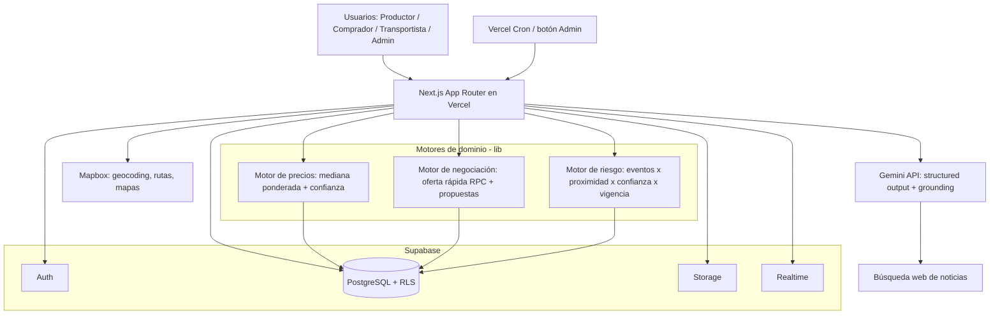
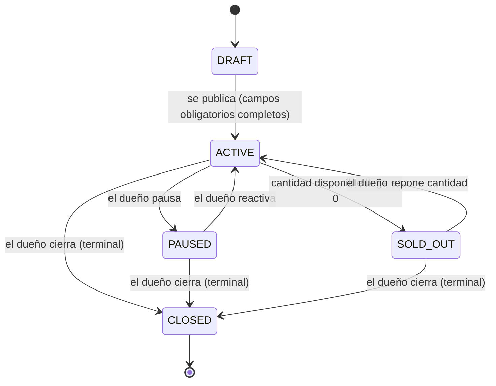
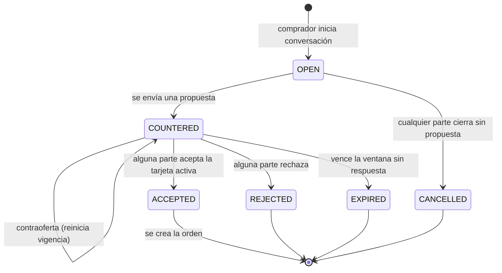

# Conecta — Arquitectura del Proyecto

> Marketplace rural peruano: productores, compradores y transportistas con negociación (rápida y conversacional), logística con subasta inversa de fletes y riesgo territorial explicado.

---

## 1. Stack

| Capa | Tecnología |
|---|---|
| Framework | Next.js (App Router) + TypeScript |
| UI | Tailwind CSS + shadcn/ui + Lucide Icons |
| Formularios | React Hook Form + Zod |
| Notificaciones UI | Sonner |
| Fechas | date-fns |
| Base de datos | Supabase PostgreSQL (esquema `db/db_conecta.sql`, ~60 tablas normalizadas) |
| Auth | Supabase Auth |
| Storage | Supabase Storage (buckets `product-images`, `evidence`) |
| Realtime | Supabase Realtime (tabla `messages`, estados de viaje) |
| IA | **Google Gemini API** (structured output + grounding/búsqueda web para eventos de riesgo). El enum `analysis_provider` del SQL debe corregirse de `OPENAI` a `GEMINI`. |
| Mapas | Mapbox GL JS + Geocoding + Directions + Turf.js |
| Deploy | Vercel + GitHub |
| Calidad | ESLint, Prettier, Vitest |

Decisiones de ahorro: sin microservicios, sin Prisma, sin Redux, sin backend separado. Route Handlers + Server Actions. Tipos generados desde Supabase.

---

## 2. Arquitectura de alto nivel



### Reglas críticas de seguridad

- `hidden_floor_price` (tabla `offer_private_pricing`) jamás llega al cliente: evaluación por RPC transaccional en Postgres.
- `SUPABASE_SERVICE_ROLE_KEY` solo en servidor.
- RLS en todas las tablas: negociaciones/mensajes solo para participantes; órdenes solo comprador + productores + admin.
- Reserva de inventario (`inventory_reservations`) dentro de transacción para evitar doble venta.

---

## 3. Estructura de directorios completa

La aplicación web vive en `web/` (la raíz del repo conserva `db/`, `docs/` y material de diseño).

```text
web/
├── src/
│   ├── app/
│   │   ├── (public)/
│   │   │   ├── page.tsx                    # 1. Landing
│   │   │   ├── login/page.tsx              # 2. Iniciar sesión (+ acceso demo por rol)
│   │   │   ├── register/page.tsx           # 3. Registro
│   │   │   └── plans/page.tsx              # 49. Planes (marcado próxima fase)
│   │   ├── (onboarding)/
│   │   │   ├── role-selection/page.tsx     # 4. Selección de rol (multi-rol)
│   │   │   ├── producer/page.tsx           # 5. Onboarding productor (stepper 6 pasos)
│   │   │   ├── buyer/page.tsx              # 6. Onboarding comprador (stepper 6 pasos)
│   │   │   ├── transporter/page.tsx        # 7. Onboarding transportista (stepper 7 pasos)
│   │   │   └── verification/page.tsx       # 8. Verificación de perfil
│   │   ├── (dashboard)/
│   │   │   ├── layout.tsx                  # Sidebar desktop / bottom-nav móvil + rol activo
│   │   │   ├── home/page.tsx               # 9-11. Dashboard según rol activo
│   │   │   ├── marketplace/
│   │   │   │   ├── page.tsx                # 12-13. Grid + toggle mapa
│   │   │   │   ├── offers/[id]/page.tsx    # 14. Detalle de producto
│   │   │   │   └── requests/[id]/page.tsx  # 15. Detalle de requerimiento
│   │   │   ├── publish/
│   │   │   │   ├── offer/page.tsx          # 16. Publicar producto (stepper 8 pasos)
│   │   │   │   └── request/page.tsx        # 17. Publicar requerimiento (stepper 9 pasos)
│   │   │   ├── negotiations/
│   │   │   │   ├── page.tsx                # 21. Bandeja de conversaciones
│   │   │   │   └── [id]/page.tsx           # 22-25. Sala + propuestas + comparar + match
│   │   │   ├── orders/
│   │   │   │   ├── page.tsx                # Listado de órdenes
│   │   │   │   ├── [id]/page.tsx           # 27-28. Resumen + detalle con tabs
│   │   │   │   ├── [id]/logistics/page.tsx # 29. Seleccionar modalidad logística
│   │   │   │   └── [id]/suppliers/page.tsx # 26. Selección múltiples productores
│   │   │   ├── transport/
│   │   │   │   ├── page.tsx                # 31. Marketplace de cargas
│   │   │   │   ├── new/page.tsx            # 30. Crear solicitud de transporte
│   │   │   │   ├── [id]/page.tsx           # 32. Detalle solicitud + 33. ofertar
│   │   │   │   └── [id]/compare/page.tsx   # 34. Comparar ofertas de flete
│   │   │   ├── trips/
│   │   │   │   ├── page.tsx                # Viajes del transportista
│   │   │   │   ├── [id]/page.tsx           # 39. Seguimiento del viaje
│   │   │   │   ├── [id]/pickup/page.tsx    # 40. Registrar recojo
│   │   │   │   ├── [id]/delivery/page.tsx  # 41. Registrar entrega
│   │   │   │   └── [id]/incident/page.tsx  # 42. Reportar incidencia
│   │   │   ├── vehicles/
│   │   │   │   ├── page.tsx                # Flota del transportista
│   │   │   │   └── [id]/page.tsx           # 36. Detalle de vehículo
│   │   │   ├── risk/[id]/page.tsx          # 37. Detalle de riesgo + 38. mapa de ruta
│   │   │   ├── profiles/[id]/page.tsx      # 43-45. Perfil público según rol
│   │   │   ├── saved/page.tsx              # 46. Favoritos y guardados
│   │   │   ├── notifications/page.tsx      # 47. Notificaciones
│   │   │   ├── settings/page.tsx           # 48. Configuración
│   │   │   ├── credits/page.tsx            # 50. Créditos transportista (próxima fase)
│   │   │   └── admin/
│   │   │       ├── page.tsx                # 52. Dashboard administrativo
│   │   │       ├── risk-events/page.tsx    # 53. Gestión de eventos
│   │   │       ├── risk-events/new/page.tsx# 54. Crear/editar evento
│   │   │       ├── prices/page.tsx         # 55. Observaciones de precios + CSV
│   │   │       ├── verification/page.tsx   # 56. Verificación de usuarios
│   │   │       ├── moderation/page.tsx     # 57. Moderación
│   │   │       ├── analytics/page.tsx      # 58. Analítica
│   │   │       └── demo/page.tsx           # 24. Panel de demo (seed, actualizar riesgos)
│   │   ├── api/
│   │   │   ├── price/suggest/route.ts
│   │   │   ├── negotiations/quick-offer/route.ts
│   │   │   ├── negotiations/[id]/messages/route.ts
│   │   │   ├── negotiations/[id]/proposals/route.ts
│   │   │   ├── negotiations/[id]/accept/route.ts
│   │   │   ├── orders/route.ts
│   │   │   ├── orders/[id]/select-logistics/route.ts
│   │   │   ├── shipments/route.ts
│   │   │   ├── shipments/[id]/bids/route.ts
│   │   │   ├── shipments/[id]/select-bid/route.ts
│   │   │   ├── risk/analyze/route.ts       # Gemini grounding -> eventos JSON validados
│   │   │   ├── risk/report/route.ts
│   │   │   ├── admin/risk-events/route.ts
│   │   │   └── jobs/risk-scan/route.ts     # Cron / botón admin
│   │   ├── layout.tsx
│   │   └── globals.css
│   ├── components/
│   │   ├── ui/                # shadcn/ui
│   │   ├── brand/             # Logo SVG programático + iconos de categoría propios
│   │   ├── layout/            # Sidebar, BottomNav, RoleSwitcher, TopBar
│   │   ├── marketplace/       # ProductCard, RequestCard, PriceSuggestionBadge,
│   │   │                      # RiskBadge, ConfidenceBadge, LocationBadge,
│   │   │                      # NegotiationModeBadge, QuantityBadge, Filters
│   │   ├── negotiation/       # QuickOfferDialog, PriceStepper, ProposalCard,
│   │   │                      # NegotiationTimer, ChatMessage, MatchSuccessDialog,
│   │   │                      # ProposalCompare
│   │   ├── logistics/         # LogisticsModeSelector, VehicleCard, FreightBidCard,
│   │   │                      # FreightCompareTable, ShipmentTimeline
│   │   ├── risk/              # RiskBreakdown, RiskEventCard, RiskGauge, SourceList
│   │   ├── maps/              # RouteMap, MarketplaceMap, EventMarkers
│   │   ├── orders/            # OrderSummaryCard, SupplierAllocationTable, OrderTimeline
│   │   ├── admin/             # RiskEventForm, RiskEventTable, PriceObservationForm,
│   │   │                      # SeedDemoButton, VerificationQueue
│   │   └── shared/            # EmptyState, ErrorState, OfflineState, DemoDataBanner,
│   │                          # Stepper, StatCard, PhotoUpload
│   ├── lib/
│   │   ├── supabase/          # client.ts, server.ts, middleware.ts, types.gen.ts
│   │   ├── ai/                # gemini.ts, risk-extraction.ts, schemas.ts (Zod)
│   │   ├── pricing/           # suggest.ts (mediana ponderada, confianza, rango)
│   │   ├── negotiation/       # quick-offer.ts, proposal.ts, states.ts
│   │   ├── risk/              # score.ts (severidad×proximidad×confianza×vigencia)
│   │   ├── maps/              # mapbox.ts, route.ts, proximity.ts (Turf)
│   │   ├── validations/       # Zod schemas por dominio
│   │   ├── mock/              # Datos demo coherentes (Puno/Arequipa) para prototipo
│   │   └── utils.ts
│   ├── types/                 # Tipos de dominio (estados, roles, enums)
│   └── tests/                 # Vitest: oferta rápida, precio, riesgo
├── supabase/
│   ├── migrations/            # Derivadas de db/db_conecta.sql
│   ├── seed.sql
│   └── config.toml
├── .env.example
└── package.json
```

---

## 4. Roles y navegación

| Sección | Productor | Comprador | Transportista | Admin |
|---|:-:|:-:|:-:|:-:|
| Dashboard propio (9/10/11) | ✅ | ✅ | ✅ | 52 |
| Marketplace productos (12-14) | ✅ ver | ✅ comprar | 👁 | 👁 |
| Requerimientos (15, 17) | ✅ postular | ✅ publicar | — | 👁 |
| Publicar producto (16) | ✅ | — | — | — |
| Negociaciones (18-25) | ✅ | ✅ | — | 👁 |
| Órdenes (26-28) | ✅ parte | ✅ dueño | 👁 asignado | ✅ |
| Logística (29-30, 34) | ✅ | ✅ | — | 👁 |
| Marketplace de cargas (31-33) | — | — | ✅ | 👁 |
| Vehículos (36) | — | — | ✅ | 👁 |
| Viajes (39-42) | 👁 | 👁 | ✅ | ✅ |
| Riesgo (37-38) | ✅ | ✅ | ✅ | ✅ gestiona |
| Admin (52-58) | — | — | — | ✅ |

Un usuario puede tener múltiples roles (`user_roles`); el **rol activo** cambia desde el sidebar y condiciona dashboard, navegación y CTAs.

---

## 5. Flujo maestro de la operación

```mermaid
flowchart LR
    PUB[Productor publica producto] --> MKT[Comprador explora marketplace]
    MKT --> NEG{Negociación}
    NEG -->|Rápida: precio >= mínimo privado| MATCH[Match automático]
    NEG -->|Conversacional: propuesta aceptada| MATCH
    MATCH --> ORD[Orden comercial]
    ORD --> LOG{Logística}
    LOG -->|Recoge comprador| DESP[Despacho]
    LOG -->|Entrega productor| DESP
    LOG -->|Marketplace de fletes| BID[Transportistas ofertan] --> SEL[Selección por tarifa, vehículo y riesgo] --> DESP
    DESP --> TRAN[En tránsito con estados] --> ENT[Entrega + evidencias] --> FIN[Operación completada]
```



Ver el detalle exhaustivo de pantallas en `docs/DIAGRAMA_PANTALLAS.md`.

---

## 6. Estados y reglas de Publicación



- Solo el dueño de la publicación (o admin) puede pausar/reactivar/cerrar.
- Solo se listan en el marketplace público las publicaciones `ACTIVE`. `PAUSED`, `SOLD_OUT` y `CLOSED` quedan visibles únicamente en "mis publicaciones" del dueño y en negociaciones/órdenes que ya las referencian.
- Precio y cantidad son editables en `ACTIVE` y `PAUSED`, nunca en `SOLD_OUT` ni `CLOSED`.
- Cerrar (`CLOSED`) es terminal y cancela automáticamente negociaciones abiertas sin acuerdo; no afecta órdenes ya creadas.
- `CLOSED` no vuelve a abrirse — si se quiere retomar, se crea una publicación nueva.

---

## 7. Estados y reglas de Negociación conversacional



- La ventana (12/24/48/72h) se reinicia con cada contraoferta.
- Al vencer sin respuesta (`EXPIRED`), la conversación queda de solo lectura; para retomar hay que iniciar una nueva.
- `ACCEPTED` es terminal e inmediato: dispara la creación de orden y bloquea nuevas tarjetas sobre esa conversación.
- Solo puede haber una conversación con tarjeta activa por comprador-publicación a la vez.
